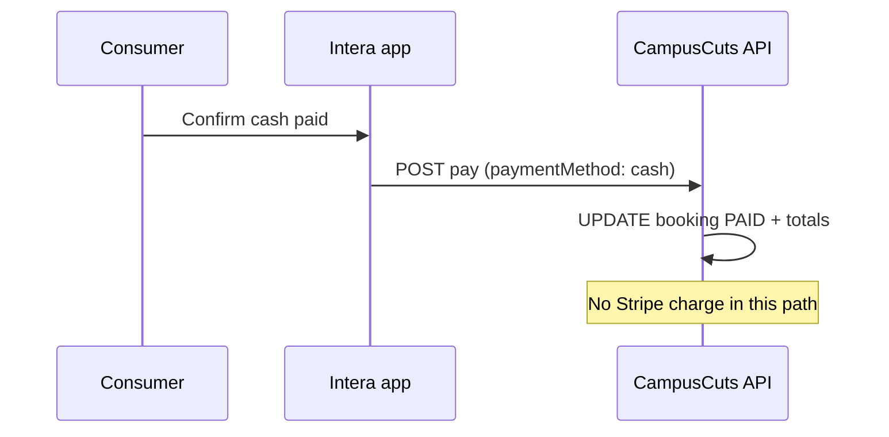

# Intera / CampusCuts — Platform overview, money flows, and charges

This document describes what the product is (as implemented in this repository), how money moves between consumers, providers, and the platform, and which **charges and fees** appear in code versus those levied by **Stripe** (third party). It is written for operators, support, and engineering; it is not legal or tax advice.

---

## 1. What this platform is

**Intera** (this repo’s iOS app) is the consumer-facing client for **CampusCuts** — a **campus marketplace for personal services** (primarily barbers / service providers). Students or guests can:

- Browse providers on **Home**, book services, and manage **Bookings**.
- Message providers through **in-app messaging** (REST + real-time).
- **Pay for completed visits** after the provider marks the booking **complete** (post-service checkout), including optional **tips**.
- Manage profile, **blocked people** in messaging, notifications, and related account flows.

The **CampusCuts** backend (`CampusCutsPackage/backend`) is an **Express** API with **PostgreSQL**, **Stripe** (payments + **Stripe Connect** for providers), webhooks, and optional paths for legacy / experimental wallet features. The mobile app talks to **`/api/v1`** (see `AppConfiguration`).

**Roles**

| Role | Who |
|------|-----|
| **Consumer** | Books and pays for services; receives messaging and payment UI. |
| **Provider (barber)** | Accepts/completes bookings; may connect a **Stripe Connect** account to receive payouts. |
| **Platform (CampusCuts)** | Operates the marketplace, sets **take rate** on the service portion of card payments, and holds the **Stripe platform account** used for PaymentIntents. |

---

## 2. End-to-end booking and payment journey (happy path)

1. **Discovery & booking** — Consumer selects a provider and creates a booking (`bookings-simple` and related flows). Price is stored (e.g. `priceUsdCents` on the booking).
2. **Lifecycle** — Typical statuses include **PENDING**, **ACCEPTED**, **COMPLETED** (provider marked service done — **awaiting consumer payment**), then **PAID** after successful settlement in the app.
3. **Payment trigger** — When status is **COMPLETED**, the consumer is prompted to pay (in-app **payment takeover**, web checkout URL pattern `…/web/payment/:bookingId`, or **Home** reminder for deferred pay-later).
4. **Card payment** — Backend creates a **Stripe PaymentIntent** for **service + optional tip** (USD). Consumer pays with **card** (Payment Sheet; **Apple Pay** when configured). On success, **`confirm-payment`** (or related paths) marks the booking **PAID** and triggers downstream notifications / conversation archival per route logic.
5. **Split** — If the provider has **`stripe_account_id`** (Connect), the PaymentIntent uses **destination charges**: Stripe splits so the **platform application fee** is taken and the remainder is available to the connected account per Stripe’s rules (see §4).

**Cash path** — Consumer can mark payment as **cash** via `POST …/bookings-simple/:id/pay` with `paymentMethod: "cash"`. No Stripe charge is created for that leg; the booking is marked **PAID** in the database. Settlement is **outside** Stripe (in person).

---

## 3. Flow of money (who receives what)

### 3.1 Card payment with Stripe Connect (normal case)

**Total charged to the consumer’s card** = **service amount** + **tip** (all in cents on the PaymentIntent).

**Platform fee (application fee)** — Implemented as **15% of the service subtotal only**, **not** on tips:

- `platformFeeCents = round(serviceAmountCents × 0.15)`  
- Examples in code: `booking-simple.routes.ts` (`PLATFORM_FEE_PERCENTAGE = 0.15`), `stripe-payment.service.ts`, `stripe-webhook-secure.controller.ts`, `payment-v2.service.ts` (`PLATFORM_FEE_RATE = 0.15`).

**Provider (barber) share (intent)** — After the platform fee on the service:

- **Barber receives** (conceptually): **(service − 15% platform fee) + 100% of tip**  
- Implemented on the PaymentIntent as: `amount = totalAmountCents`, `application_fee_amount = platformFeeCents`, `transfer_data.destination = barberStripeAccountId`, so the **connected account** receives the net after Stripe applies the application fee to the charge (see Stripe docs for exact settlement timing and balance behavior).

**Tips** — Code and comments explicitly state: **fees are not deducted from tips**; the **15%** applies only to **`priceUsdCents`** (service), not `tipAmountCents`.

### 3.2 Card payment without Connect

If the provider has **no** `stripe_account_id`:

- The PaymentIntent is still created for the consumer, but **without** `transfer_data` / Connect split in that branch.
- Logs indicate funds may land on the **platform** Stripe account and require **manual payout** to the provider (`booking-simple.routes.ts` warns: “payment goes to platform. Manual payout required.”).

### 3.3 Cash payment

- **No** Stripe PaymentIntent is required for the `cash` branch of `POST …/pay`.
- Booking is updated to **PAID** with `paymentMethod: 'cash'`.
- **No automated card-present split** runs in that path; any remittance to the provider is **outside** this card pipeline.

### 3.4 Refunds

- `stripe-payment.service.ts` exposes **`createRefund`** (full or partial) against a **payment_intent**.
- Consumer-facing refund policy and support process are **product/legal** decisions not fully encoded here.

### 3.5 Other / legacy pipelines

The repo also contains **payment-v2**, **escrow**-style naming, **Sui / bridge** references in webhooks (`stripe-webhook-secure.controller.ts`), and **walk-in** routes (`walk-in/confirm-payment`, `walk-in/record-cash`). Those may be **environment-specific** or legacy; the **primary** consumer path described in app code is **`bookings-simple` + Stripe PaymentIntent + confirm-payment**.

---

## 4. “Every charge” — inventory

### 4.1 Charges the **consumer** sees or authorizes

| Charge | What it is | When |
|--------|------------|------|
| **Service total** | Booking `priceUsdCents` / 100 in USD | PaymentIntent `amount` includes this. |
| **Tip (optional)** | Consumer-chosen amount added to PI | Same PaymentIntent; presets in app (e.g. 15% / 20% / 25% of **service** in `ConsumerPaymentTakeoverView`). |
| **Stripe processing** | **Not a separate line item in our code** — Stripe bills **processing fees** according to the **Stripe pricing** for your account and card type; typically borne by the **merchant of record** on the charge (often the platform on Connect). | After successful charge, visible in **Stripe Dashboard**. |

The consumer does **not** pay the **15% platform fee** as a separate line item; it is taken from the charge via **`application_fee_amount`** on Connect destination charges.

### 4.2 Charges / revenue the **platform** (CampusCuts) receives

| Item | Rate / basis | Source in repo |
|------|----------------|----------------|
| **Application fee (platform take)** | **15% of service amount only** (USD cents, rounded) | `PLATFORM_FEE_PERCENTAGE` / `0.15` in `booking-simple.routes.ts`, `stripe-payment.service.ts`, `stripe-webhook-secure.controller.ts`; `PLATFORM_FEE_RATE` in `payment-v2.service.ts`. |
| **Stripe fees (expense)** | Stripe’s **card processing** and Connect fees — **not hard-coded** in app UI; comments in `stripe-payment.service.ts` suggest **~4%** processing as context for why 15% exists. | Actual fees: **Stripe Dashboard** / invoices. |

### 4.3 Amounts the **provider** receives (card + Connect)

| Item | Basis | Source in repo |
|------|--------|----------------|
| **Net to connected account** | **Total charge − application fee** on the PaymentIntent (with fee computed on service only) | `booking-simple.routes.ts` logs `barberEarnings = totalAmountCents - platformFeeCents`; webhook path records `barber_earnings_cents` when destination charges apply. |
| **Tips** | **100%** to provider (no platform % on tips) | Comments + PI math in `booking-simple.routes.ts` / `stripe-payment.service.ts`. |

### 4.4 Internal / ledger-style records (not separate “charges” to the user)

- **`payments`** table updates: `platform_fee_cents`, `barber_earnings_cents`, `transfer_status`, `stripe_transfer_id` (webhook / payout helpers).
- **`pending_payouts`** — If Connect is missing or transfer fails, amounts may be queued for later.
- **`platform_fees`** — `payment-v2.service.ts` attempts `INSERT INTO platform_fees` (table may not exist in all deployments — guarded with a warn).

### 4.5 Charges this codebase does **not** implement as product fees

- **Apple In-App Purchase** for the booking itself — payments go through **Stripe**, not IAP, for the flows documented above.
- **Sales tax / VAT** — Not described in the reviewed payment-intent snippet; if required, it would be a **product/accounting** addition in Stripe or your catalog.

---

## 5. Sequence diagrams (conceptual)

### 5.1 Card checkout with Connect

```mermaid
sequenceDiagram
    participant C as Consumer
    participant I as Intera app
    participant API as CampusCuts API
    participant S as Stripe
    participant P as Provider Connect account

    C->>I: Pay after COMPLETED
    I->>API: POST create-payment-intent
    API->>S: PaymentIntents.create(amount, application_fee_amount, transfer_data.destination)
    S-->>API: client_secret
    API-->>I: client_secret + paymentIntentId
    I->>S: Confirm payment (PaymentSheet / Apple Pay)
    S-->>C: Card charged (total = service + tip)
    Note over S,P: Stripe splits: application fee to platform balance; net to connected account per Connect rules
    I->>API: POST confirm-payment
    API->>API: Mark booking PAID, notify provider
```

### 5.2 Cash checkout



---

## 6. Configuration and compliance touchpoints

- **Stripe keys** — Publishable key on client (`StripeService` / plist); secret keys and webhook signing secrets on server (`stripe` config).
- **Connect onboarding** — Provider `stripe_account_id` on `users` (or related tables) gates automatic split vs manual payout.
- **Webhooks** — `stripe-webhook-secure.controller.ts`: signature verification, idempotency (`stripe_webhook_events`), post-verify PaymentIntent, payout / recording logic.

---

## 7. Glossary

| Term | Meaning |
|------|---------|
| **PaymentIntent** | Stripe object representing one attempt to collect card payment for an amount. |
| **Destination charge** | Charge on the platform with `transfer_data.destination` set to the provider’s Connect account. |
| **Application fee** | Stripe Connect mechanism: platform’s portion of a charge (`application_fee_amount`). |
| **`priceUsdCents`** | Service price on the booking (fee base for 15%). |
| **`tipAmountCents`** | Optional tip; excluded from the 15% fee base in the reviewed implementation. |

---

## 8. Document maintenance

When you change take rate, tax, or payment routes, update:

- `CampusCutsPackage/backend/src/routes/booking-simple.routes.ts` (create-payment-intent),
- `CampusCutsPackage/backend/src/services/stripe-payment.service.ts`,
- `CampusCutsPackage/backend/src/controllers/stripe-webhook-secure.controller.ts`,
- and this file so support and finance stay aligned.

**Last reviewed against repository:** February 2026 (code search across `CampusCutsPackage/backend` and `Intera/Intera` payment flows).
